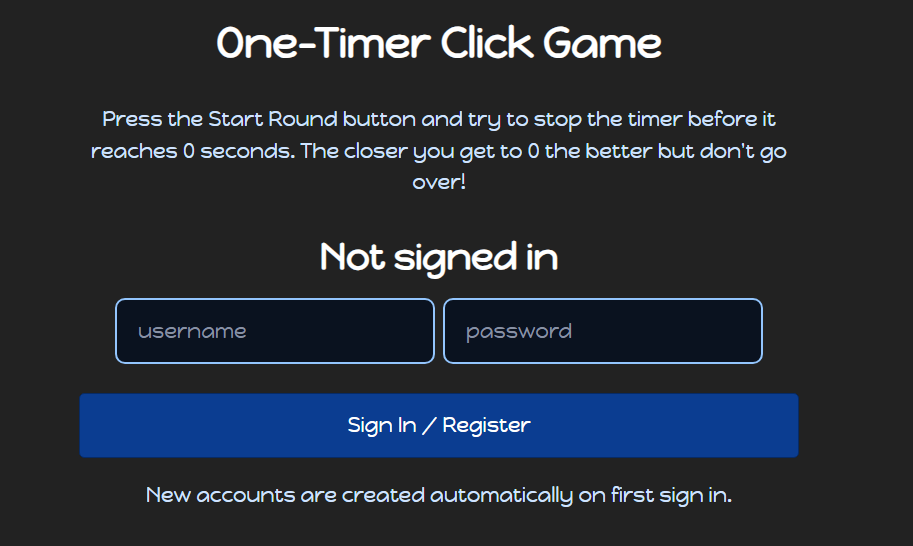
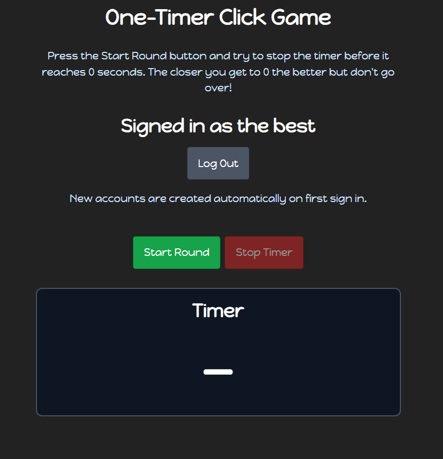
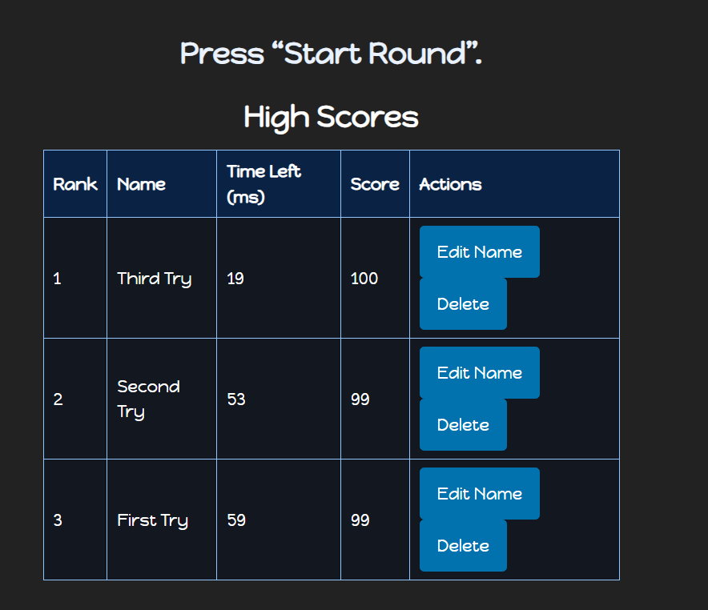

# One-Timer Click Game
### Site Link: https://a3-timothyhutzley-production.up.railway.app/
## Project Summary
**Goal**  
Create a web app where users can sign in and play a timing game where they have to stop a 5 second timer as close to 0 as possible. They can then submit their highscores under a nickname and from there edit any entered nickname under their account or delete any entry also under their account.

**Test Account With Data**
- *Username* - The Best
- *Password* - undefeated

**Images of Site**

**Challenges**  
- Securely incorporating auth so that the stored data is scoped per user
- Getting MongoDB Atlas to connect when attempting to deploy through Railway 

**Authentication Strategy**  
- Each user has a Username + Password with automatic account creation for the first sign in
- Password is hashed with `bcrypt` and tracked using a `cookie-session` session cookie1
- Chose this method as it seemed to be the simplest way to implement authentication

**CSS Framework**  
- **PicoCSS** as it has a clean design and is easy to implement as it changes the stylign of the base elements I was already mostly using  
- **Custom CSS** for an overall darker theme, changing button colors, stlying the leaderboard table, and general layout design

**Express middleware used**  
- `express.json()` - Parses JSON requests 
- `express.static()` - Serves static files from `/public`  
- `cookie-session` - provides httpOnly session cookies for a logged in state  
- `requireAuth(req,res,next)` (*Custom Function*) - Rejects unauthenticated requests and ensures all data is scoped by user.

## Accessibility
1. **Descriptive, unique page title**: Added a clear page title describing the app and how it functions

2. **Use headings to convey structure**: Used elements such as `<h1>` for the app name and `<h2>` headings for the Auth, Controls, Timer, and High Scores sections.

3. **Provide clear instructions**: Wrote brief explanation on how to play the one-timer click game and how the sign-in/automatic account creation works

4. **Keep content concise**: Used short labels for the game buttons and other messages, for example, the “Start Round” and “Stop Timer” buttons and “Score saved!” message

5. **Sufficient color contrast**: Created a dark theme with contrasting colors and ensured that they met the Google Lighthouse accessbility standards

6. **Group related content with headings/spacing**: Grouped sections Auth, Controls, Timer, and Scores into clear groups separate from each other with consistent spacing

7. **Design for different viewport sizes**: Added the responsive viewport meta tag and used both adaptable widths and the PicoCSS framework to ensure the layout changes for different screen sizes.

8. **Provide feedback for user actions**: Update different regions based on how the user interacts with the site, for example, display who the user is logged in as, change button states depending on if the round is started, and feedback is provided when scores are submitted through messages and an updated leaderboard

9. **Visible keyboard focus**: Kept default focus indicators and did not remove outlines to keep keyboard focus visible.

10. **Identify page language**: Set `lang="en"` on the `<html>` element so the correct language profile is used.

11. **Use semantic markup for structure**: Used elements such as `<main>`, `<section>`, semantic headings, and a `<table>` with `<thead>`/`<tbody>` to display the meaning in the markup structure

12. **Help users avoid & correct mistakes**: Included required fields, disabled invalid actions such as clicking the "Stop Timer" button before the "Start Round" button, and displayed messages for errors and to confirm user actions.

## CRAP Principles
- **Contrast** - On the site, contrast is used to direct the user without overwhelming them. For example, on the inital login page, contrasting the darker background at the top is an explanation on how the game works, followed by similar text indicating the user is not signed in. These two text sections make use of lighter text color and heavier font weight to contrast the background helping users quickly uinderstand what is going on. The login section itself is also clearly defined using outlines and a separate blue color that stands out. After signing in, the "Start Round" and "Stop Timer" buttons are green and red respectively, helping indicate the general use for each button and makign them easy to distinguish from the rest of the page. Lastly, the timer itself is also confined within a box and formatted similar to previous text but now a much larger font size, making it easy to follow as the time ticks down. 
- **Repetition** - On the site, repetition is used to create a sense of cohesion throughout the site for the user which makes it easier to recognize the differences in each section. For styling, the site consistenly uses default PicoCSS, as well as consistent spacing and text formatting (Game xplanation, User display, Timer). Colors for both login and submitting scores are consistent providing better recognition for the functionality of differnet buttons on the site. Additionally, the leaderboard table is consistent in stlying with nothing changing between rows making it easy to find different scores. Additionally, buttons are conssitenly disabled or removed when the action is not possible, creating a sense of trust in the actions the user can commit as the ones they can't no longer appear. Lastly, messages and other feedback appear in the same format and place so the user knows where to look when it expects any messages or feedback from the site.
- **Alignment** - On the site, alignment is used to orgnaize the displayed information into a clear path as to how the user should read it. The information on the site is all centered and goes straight down creating a clear top down reading path for the user to follow. This is established by a fixed width for the elements on the page, so no element is too long making it overwhelming or distracting. Each section has a clear header that leads into the the section itself, helping guide the user through the site. The leaderboard table itself is left-aligned making it easy for users to read through it from left to right when going through their scores. The timer that the user needs to focus on for the game is also center-aligned, making it easy to watch and stay focused on as the time ticks down. 
- **Proximity** - On the site, proximity is used to group elements that go together and separate them from the elements that they are not associated with. When initially opening the site, there is a clear title for the site at the top with a brief description directly under it grouping them together. Under the description, is a a tightly grouped together section displaying "Not signed in" with two input boxes for a username and password, along with a sign in/register button directly below those input boxes. After signing in the user then sees a section where elements such as the "Start Round" and "Stop Timer" buttons and the timer itself are tightly grouped together to display the game. Lastly, after a small gap is the status of the game which displays the users final time remaining, along with a nickname submission box for the leaderboard, and the leaderboard itself, creating the final section of the site where all the scores are displayed.
